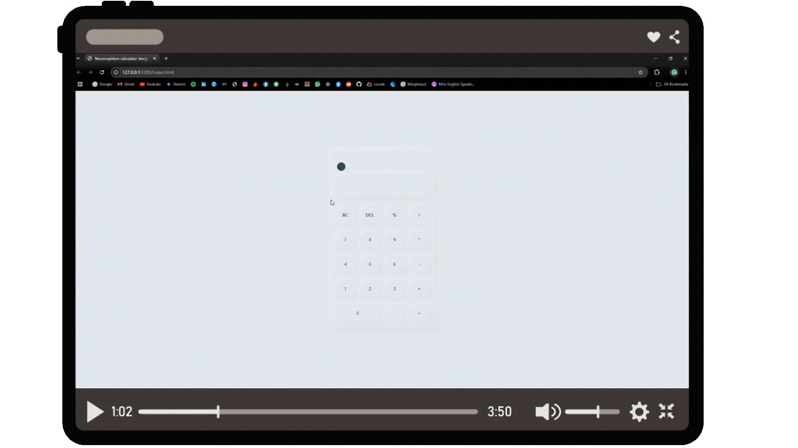
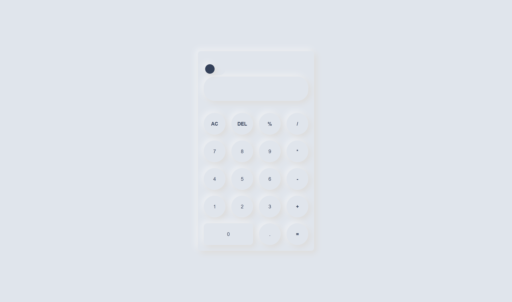
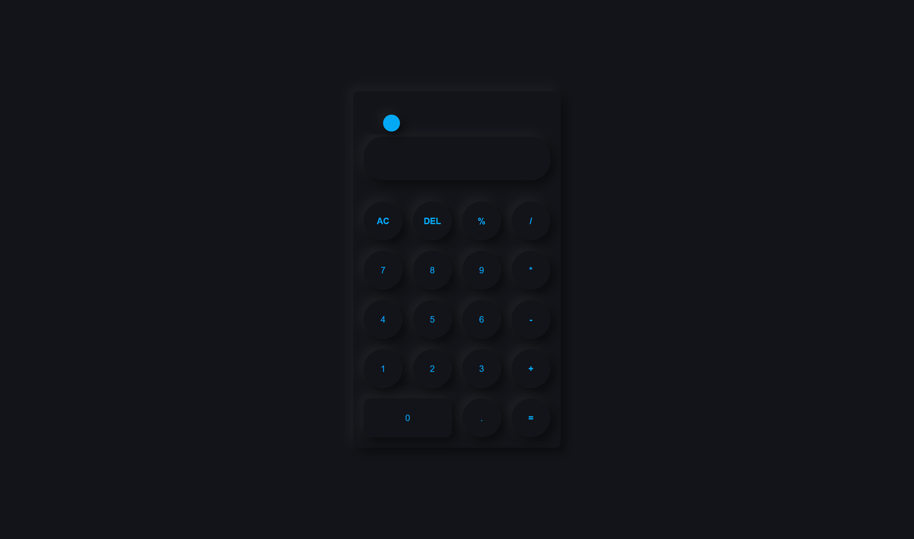

# ✨ Neumorphism Calculator - JavaScript Project 2

A sleek and modern **Neumorphic Calculator** with dual themes (Dark & Light) and fully functional calculator operations. This project highlights clean UI design and JavaScript functionality to provide a seamless user experience.

---

## 🌟 Features
- **Dual Themes**: Switch between **Dark Mode** and **Light Mode** for a personalized experience.
- **Full Functionality**: Perform basic arithmetic operations such as addition, subtraction, multiplication, and division.
- **Neumorphic Design**: A visually appealing interface using modern Neumorphism UI principles.
- **Responsive Design**: Optimized for desktop and mobile devices.

---

## 🚀 Demo
<!-- Check out the **live demo** of the project here:  
[Live Demo](#) -->

 <!-- Upload the demo GIF file as 'calculator-demo.gif' -->

---

## 🖼️ Screenshots

### 🌞 Light Theme
 <!-- Replace 'light-theme.png' with the actual image file name -->

### 🌑 Dark Theme
 <!-- Replace 'dark-theme.png' with the actual image file name -->

---

## 💻 Technologies Used
- **HTML5** for structuring the calculator UI.
- **CSS3** for styling, with a focus on Neumorphism design.
- **JavaScript** for calculator functionality and theme toggling.

---
<!--
## ⚙️ How to Use -->

